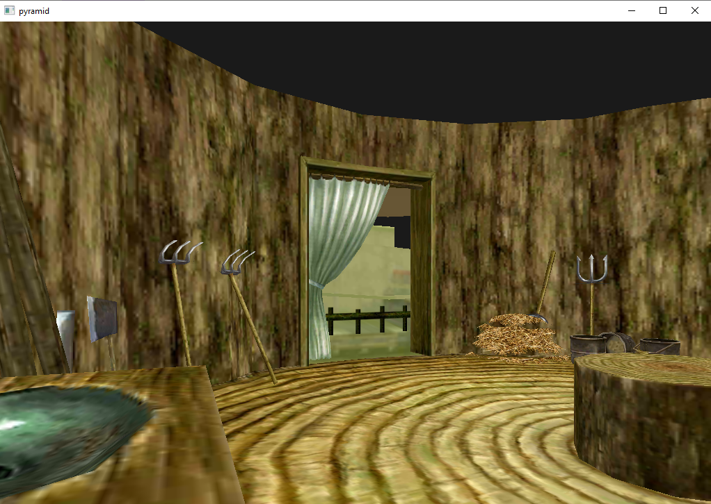
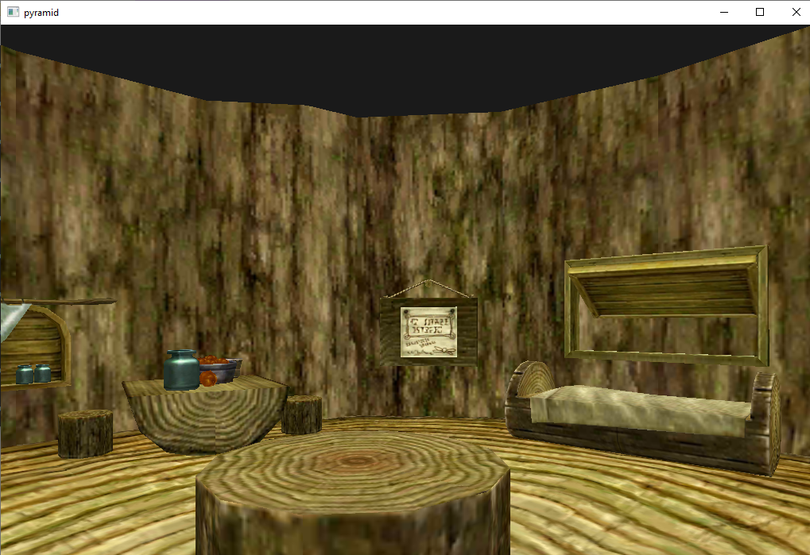

# Assignment 4 - Readme


The project was created using CodeBlocks and can be compiled by the make file. To execute the program, simply run `make`.

In addition, precompiled binaries and their requirements are available in the `backupbinary` folder. The CodeBlocks project file is also included, and the project can be built from there.

## How to Run

Prebuilt binary is in the `backupbinary` directory. Program can be launched from scene.exe


## How to Compile
If you would like to compile the project your self, navigate to the the `Assignment 4` directory and execute:

```
make
```
Alternatively you can open the CodeBlocks project file (`3D scene.cbp`) and build from there.

When the project is built the executable will be in the bin folder. This executable relies on 4 requirements:

```
\assets
libgcc_s_seh-1.dll
libstdc++-6.dll
libwinpthread-1.dll
```

These can be copied over from the backupbinary directory.

Source code can be found in `Assignment 4/src`

## Screenshots



